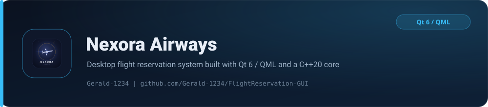

<p align="center">
  <picture>
    
  </picture>
</p>

<p align="center">
  <strong>A desktop flight-reservation system with a fluid QML interface and a strongly-typed C++20 reservation engine.</strong>
</p>

<p align="center">
  
  
  
</p>
<p align="center">
  
  
  
</p>
<p align="center">
  
  
  
</p>

Nexora Airways is a full-featured airline booking application with a glass-styled QML interface backed by a strongly-typed C++20 reservation engine. It covers the complete booking lifecycle, from account creation and seat selection to secure online payments, across customer, admin and super-admin roles, with all data persisted in an embedded SQLite database.

## Features

| Feature | Description |
| --- | --- |
| Role-based access | Customer, Admin and Super-Admin (MAX) tiers, each with a tailored interface |
| Flight management | Browse, search, create and price flights across 21 Nigerian airports with live status (Scheduled, Boarding, Departed, Delayed, Cancelled) |
| Interactive seat maps | Visual seat selection with Economy, Business and First-Class cabins, including time-bounded cancellation rules |
| Integrated payments | Wallet top-ups via the [Paystack](https://paystack.com) API, plus withdrawals and peer-to-peer transfers |
| Secure authentication | Passwords hashed with **Argon2id** (PHC winner), salted per user and verified in constant time |
| Wallet and loyalty | Account balances, transaction history and loyalty-point accrual |
| Profiles | Editable personal details and next-of-kin records for customers and admins |

## Tech stack

| Layer | Technology |
| --- | --- |
| UI | Qt 6.5+ Quick / QML with a custom glassmorphic component set |
| Application | C++20 Qt Quick backend models exposed to QML |
| Core logic | Standalone C++20 reservation library (`reservation_core`) |
| Persistence | SQLite 3 (embedded, statically linked) |
| Security | Argon2id password hashing |
| Payments | Paystack REST API over Qt Network |
| Build | CMake 3.21+, MinGW 13.1 toolchain |

## Project structure

```text
backend/       Qt/QML bridge: Backend singleton, list and seat-grid models, Paystack client
core/          C++20 reservation engine: flights, seats, users, crypto, SQLite layer
qml/           QML views and reusable UI components
third_party/   Vendored Argon2 and SQLite3 sources plus the prebuilt archives CMake links
config/        Paystack secret and super-admin bootstrap files (created from *.example.txt)
data/          SQLite database (created at runtime)
icons/         Application icons and Windows resource
```

## Building

**Prerequisites:** Qt 6.5+ (MinGW 13.1 kit), CMake 3.21+ and a C++20 compiler.

```bash
cmake -B build -S . --preset <your-preset>
cmake --build build
```

The build statically links the MinGW runtime and runs `windeployqt` automatically, producing a self-contained folder that runs on a clean Windows machine. Runtime data (database, payment config, icons) is copied next to the executable as part of the build.

> **Note:** Argon2 and SQLite3 are compiled from source under `third_party/` using the same **MinGW-Builds 13.1.0 (MSVCRT)** toolchain as Qt. Mixing other prebuilt archives causes a startup load failure. Rebuild the archives with `third_party/build_thirdparty.sh` if needed.

## Configuration

Configuration files are intentionally not committed. Copy the examples and fill in your own values:

```bash
cp config/paystack_secret.example.txt config/paystack_secret.txt
cp config/super_admin.example.txt config/super_admin.txt
```

| File | Purpose |
| --- | --- |
| `config/paystack_secret.txt` | Paystack secret key used for payment processing |
| `config/super_admin.txt` | Bootstrap password for the super-admin account |

Both files are read from the first line and are ignored by git, so real credentials stay out of the repository.

## License

Released under the [MIT License](LICENSE). Vendored third-party libraries retain their own licenses:

- [PHC winner Argon2](https://github.com/P-H-C/phc-winner-argon2) (CC0 / Apache-2.0)
- [SQLite](https://www.sqlite.org/) (public domain)
- [nlohmann/json](https://github.com/nlohmann/json) (MIT)

<p align="center"><sub>Built and maintained by <a href="https://github.com/Gerald-1234">Gerald-1234</a></sub></p>
