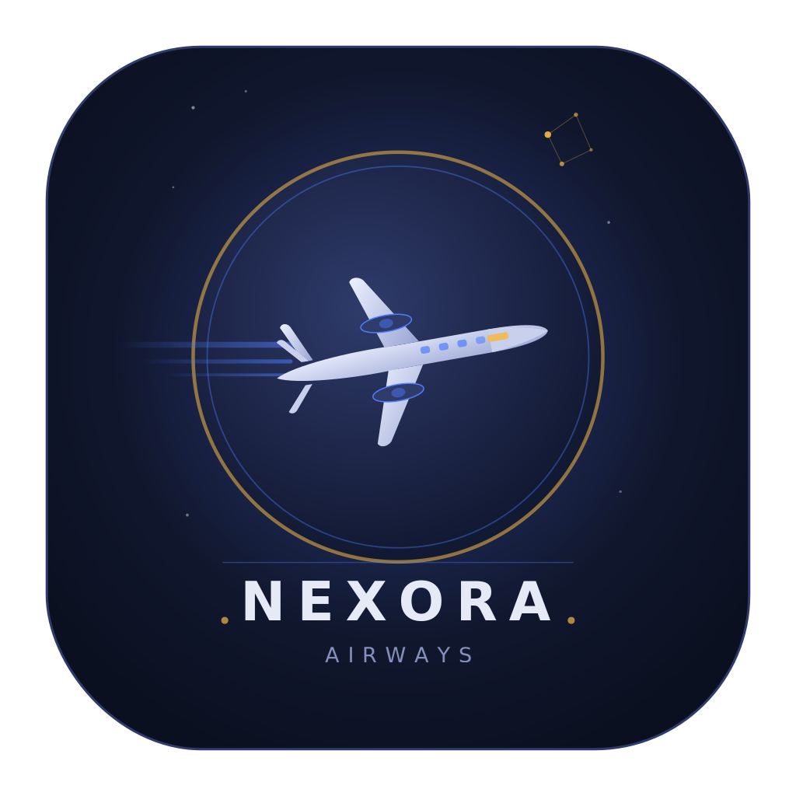

<div align="center">



# Nexora Airways

**A modern desktop flight-reservation system built with Qt 6 / QML and a C++20 core.**

</div>

---

## Overview

Nexora Airways is a full-featured airline booking application with a fluid, glass-styled QML interface backed by a strongly-typed C++20 reservation engine. It supports the complete booking lifecycle — from account creation and seat selection to secure online payments — across customer, admin, and super-admin roles, with all data persisted in an embedded SQLite database.

## Features

- **Role-based access** — Customer, Admin, and Super-Admin (MAX) tiers, each with a tailored interface.
- **Flight management** — Browse, search, create, and price flights across 21 Nigerian airports with live status (Scheduled, Boarding, Departed, Delayed, Cancelled).
- **Interactive seat maps** — Visual seat selection with Economy, Business, and First-Class cabins, including time-bounded cancellation rules.
- **Integrated payments** — Online wallet top-ups via the [Paystack](https://paystack.com) API, plus withdrawals and peer-to-peer transfers.
- **Secure authentication** — Passwords hashed with **Argon2** (PHC winner) and salted per user.
- **Customer wallet & loyalty** — Account balances, transaction history, and loyalty-point accrual.
- **Profile & next-of-kin records** — Editable personal details for customers and admins.

## Tech Stack

| Layer        | Technology                                              |
| ------------ | ------------------------------------------------------- |
| UI           | Qt 6.5+ Quick / QML (custom glassmorphic component set) |
| Application  | C++20, Qt Quick backend models exposed to QML           |
| Core logic   | Standalone C++20 reservation library (`reservation_core`) |
| Persistence  | SQLite 3 (embedded, statically linked)                  |
| Security     | Argon2 password hashing                                 |
| Payments     | Paystack REST API over Qt Network                       |
| Build        | CMake 3.21+, MinGW 13.1 toolchain                       |

## Project Structure

```
backend/       Qt/QML bridge — Backend singleton, list & seat-grid models, Paystack client
core/          C++20 reservation engine — flights, seats, users, crypto, SQLite layer
qml/           QML views and reusable UI components
third_party/   Vendored Argon2 & SQLite3 (built from source)
config/        Paystack secret & super-admin configuration
data/          SQLite database
icons/         Application icons and Windows resource
```

## Building

**Prerequisites:** Qt 6.5+ (MinGW 13.1 kit), CMake 3.21+, and a C++20 compiler.

```bash
cmake -B build -S . --preset <your-preset>
cmake --build build
```

The build statically links the MinGW runtime and runs `windeployqt` automatically, producing a self-contained folder that runs on a clean Windows machine. Runtime data (database, payment config, icons) is copied next to the executable as part of the build.

> **Note:** Argon2 and SQLite3 are compiled from source under `third_party/` using the **same MinGW-Builds 13.1.0 (MSVCRT)** toolchain as Qt — mixing other prebuilt archives causes a startup load failure.

## Configuration

- `config/paystack_secret.txt` — Paystack secret key for payment processing.
- `config/super_admin.txt` — bootstrap super-admin credentials.

## License

This project is provided for educational and demonstration purposes. Vendored third-party libraries (Argon2, SQLite3) retain their respective licenses.
